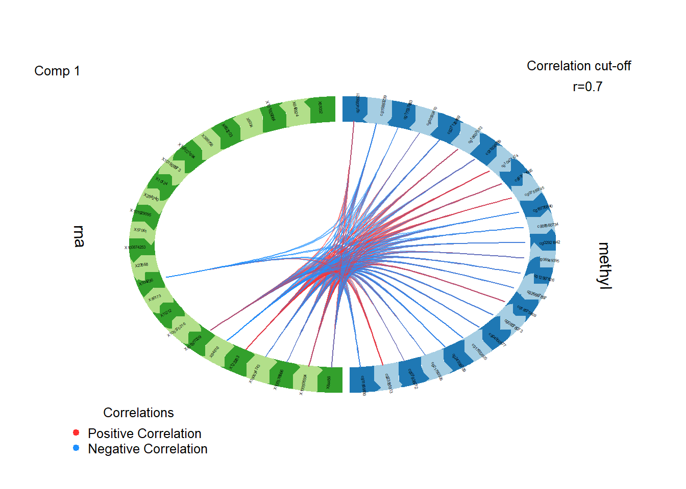

# 🧬 Multi-Omics Analysis of Multiple Sclerosis Lesions

🔍 **GEO Dataset: [GSE224377](https://www.ncbi.nlm.nih.gov/geo/query/acc.cgi?acc=GSE224377)**  
👨‍🔬 **Conducted during the ABCON 2025 Multi-Omics Workshop**  
📅 **Analysis completed on: August 10, 2025**  
📁 **Full details in [`analysis_report.md`](analysis_report.md)**

---

## 📚 Overview

This project performs a comprehensive, step-by-step multi-omics analysis of **RNA-seq** and **DNA methylation** data derived from demyelinated lesions in multiple sclerosis (MS) brains. Using a curated version of **GSE224377**, the analysis integrates transcriptional and epigenetic signatures to identify disease-associated molecular networks.

---
## 📑 Table of Contents

- [Overview](#-overview)
- [Objectives](#-objectives)
- [Dataset Summary](#-dataset-summary)
- [Key Analysis Steps](#-key-analysis-steps)
- [Biological Insights](#-biological-insights)
- [Project Structure](#-project-structure)
- [Highlighted Outputs](#-highlighted-outputs)
- [Interactive HTML Reports](#-interactive-html-reports)
- [Selected Results (Preview)](#-selected-results-preview)
- [Reproducibility](#-reproducibility)
- [Acknowledgment](#-acknowledgment)
- [Author Contribution](#-author-contribution)
- [Citation & Usage](#-Citation--Usage)
- [License](#-License)


---

## 🎯 Objectives

- Preprocess and normalize gene expression and methylation datasets.
- Identify significant **DEGs** and **DMRs** across MS lesions and NAWM.
- Explore omics relationships through **correlation**, **regression** and **network analysis**.
- Apply **GO enrichment** and **DIABLO integration** to reveal biologically relevant pathways.

---

## 🧪 Dataset Summary

| Feature | Description |
|--------|-------------|
| Organism | *Homo sapiens* |
| Samples | Matched MS lesions & NAWM from 9 patients |
| Data Types | RNA-seq counts, 450k methylation |
| Platform | Illumina HiSeq 4000 |
| Publication | Tiane et al., Acta Neuropathol, 2023 ([PMID: 37286732](https://pubmed.ncbi.nlm.nih.gov/37286732/)) |

---

## 🧠 Key Analysis Steps

> All implemented in modular `.Rmd` files and compiled to HTML with figures and outputs.

| Task | Description |
|------|-------------|
| `00` | Setup and package installation |
| `01` | Load libraries and configure environment |
| `02` | RNA-seq preprocessing: filtering, TMM normalization, z-score, min-max |
| `03` | PCA: sample-level and gene-level structure visualization |
| `04` | Differential expression (edgeR) & methylation (lm, glm, t-test) |
| `05` | DEG–DMR correlation with linear regression (adjusted for age & gender) |
| `06` | Multi-layered network construction (Gene–Gene, CpG–CpG, CpG–Gene) |
| `07` | GO enrichment (clusterProfiler) for DEGs and DMR-associated genes |
| `08` | DIABLO modeling (mixOmics) for integrative multi-omics classification |

---

## 📈 Biological Insights

- Identified key **differentially expressed genes (DEGs)** and **differentially methylated CpGs (DMRs)** between MS lesions and NAWM.
- Significant **GO terms** included immune activation, glial differentiation, and cell signaling.
- Regression revealed age- and sex-adjusted **CpG–gene** interactions.
- DIABLO integration distinguished lesions with **85% accuracy**, pinpointing key genes and CpGs for future study.

---

## 📂 Project Structure

```
Multi-Omics-Analysis-of-Multiple-Sclerosis-Lesions
│
├── data                       # Raw input files
│   ├── GSE224377_raw_counts_GRCh38.p13_NCBI.tsv
│   ├── Methylation_20000_Top_expressed.csv
│   └── metadata-new.csv
│
├── scripts                    # R Markdown scripts for each analysis step
│   ├── 00_setup_instructions.Rmd
│   ├── 01_libraries_setup.Rmd
│   ├── 02_RNAseq_Preprocessing.Rmd
│   ├── 03_PCA_Analysis.Rmd
│   ├── 04_DEG_DMR_Analysis.Rmd
│   ├── 05_Integration_Regression.Rmd
│   ├── 06_Network_Construction.Rmd
│   ├── 07_GO_Enrichment_Analysis.Rmd
│   └── 08_DIABLO-Model.Rmd
│
├── results                    # Processed results
│   ├── Filtered_counts_less90perc_zeros.csv
│   ├── RNA_log2_CPM_TMM_filtered.csv
│   ├── RNA_TMM_log2_zscore.csv
│   ├── RNA_TMM_log2_minmax_scaled.csv
│   ├── DEG_results_all.csv
│   ├── DEG_significant_filtered.csv
│   ├── dmrs_methylation.csv
│   ├── dmrs_glm_filtered.csv
│   ├── dmrs_methylation_lm_based.csv
│   ├── DEG_DMR_linear_models_withAgeGender.csv
│   ├── full_multiomics_network.csv
│   ├── gene_edges_annotated.csv
│   ├── cpg_edges_annotated.csv
│   ├── gene-cpg_edges_annotated.csv
│   ├── selected_genes_component1.csv
│   ├── selected_genes_component2.csv
│   ├── selected_cpgs_component1.csv
│   └── selected_cpgs_component2.csv
│
├── figures                    # Visual outputs
│   ├── partial_correlation_density_plot.png
│   ├── partial_correlation_density_cdf_plot.png
│   ├── histogram_rna_tmm_log2_zscore.pdf
│   ├── histogram_rna_log2_cpm_tmm_filtered.pdf
│   ├── histogram_filtered_counts_less90perc_zeros.pdf
│   ├── histogram_raw_counts.pdf
│   ├── dmr_associated_gene_go_enrichment.png
│   ├── diablo_sample_projection.png
│   ├── diablo_plot_rna_loadings.png
│   ├── diablo_plot.png
│   ├── diablo_plot_methylation_loadings.png
│   ├── diablo_circos_plot.png
│   ├── deg_go_enrichment.png
│   ├── diablo_projections.png
│   ├── roc_curve_2.png
│   ├── roc_curve_1.png
│   ├── peformance_diablo.png
│   ├── pca_plots_samples.pdf
│   └── pca_plots_genes.pdf
│
├── docs               
│   ├── 00_setup_instructions.html
│   ├── 01_libraries_setup.html
│   ├── 02_RNAseq_Preprocessing.html
│   ├── 03_PCA_Analysis.html
│   ├── 04_DEG_DMR_Analysis.html
│   ├── 05_Integration_Regression.html
│   ├── 06_Network_Construction.html
│   ├── 07_GO_Enrichment_Analysis.html
│   └── 08_DIABLO-Model.html
│
├── analysis_report.md          # Full explanation of analysis logic and steps
└── README.md                   # Project summary and guidance
```


---

## 📌 Highlighted Outputs

| Output Type | File |
|-------------|------|
| RNA-seq Filtered Counts | `Filtered_counts_less90perc_zeros.csv` |
| Normalized Expression | `RNA_log2_CPM_TMM_filtered.csv` |
| DEGs | `DEG_significant_filtered.csv` |
| DMRs | `dmrs_glm_filtered.csv` |
| Combined Network | `full_multiomics_network.csv` |
| Enrichment Results | `.html` + `dotplots` |
| DIABLO Markers | `selected_genes_component1.csv`, `selected_cpgs_component1.csv` |

---
## 📢 Interactive HTML Reports

This project provides **HTML reports** generated from the R Markdown scripts for each analysis step.

* The HTML files include **formatted text, tables, and figures** for clear presentation.
* If you open the `.html` files directly from the **`docs` folder in GitHub** or download them locally, they may appear as **raw HTML code** instead of the formatted view.
* For the **best viewing experience**, use the **link provided above** or the **table below** to open the interactive HTML reports in your browser.


### View live HTML reports here:

👉 [https://Mohamed-H-Hussein.github.io/Multi-Omics-Analysis-of-Multiple-Sclerosis-Lesions/](https://Mohamed-H-Hussein.github.io/Multi-Omics-Analysis-of-Multiple-Sclerosis-Lesions/)

### Available HTML reports:

| Step | Script                   | HTML File                         |
| ---- | ------------------------ | --------------------------------- |
| 00   | Setup Instructions       | [00_setup_instructions.html](https://Mohamed-H-Hussein.github.io/Multi-Omics-Analysis-of-Multiple-Sclerosis-Lesions/00_setup_instruction.html)      |
| 01   | Load Libraries           | [01_libraries_setup.html](https://Mohamed-H-Hussein.github.io/Multi-Omics-Analysis-of-Multiple-Sclerosis-Lesions/01_libraries_setup.html)         |
| 02   | RNA-seq Preprocessing    | [02_RNAseq_Preprocessing.html](https://Mohamed-H-Hussein.github.io/Multi-Omics-Analysis-of-Multiple-Sclerosis-Lesions/02_RNAseq_Preprocessing.html)    |
| 03   | PCA Analysis             | [03_PCA_Analysis.html](https://Mohamed-H-Hussein.github.io/Multi-Omics-Analysis-of-Multiple-Sclerosis-Lesions/03_PCA_Analysis.html)            |
| 04   | DEG & DMR Analysis       | [04_DEG_DMR_Analysis.html](https://Mohamed-H-Hussein.github.io/Multi-Omics-Analysis-of-Multiple-Sclerosis-Lesions/04_DEG_DMR_Analysis.html)        |
| 05   | Integration & Regression | [05_Integration_Regression.html](https://Mohamed-H-Hussein.github.io/Multi-Omics-Analysis-of-Multiple-Sclerosis-Lesions/05_Integration_Regression.html) |
| 06   | Network Construction     | [06_Network_Construction.html](https://Mohamed-H-Hussein.github.io/Multi-Omics-Analysis-of-Multiple-Sclerosis-Lesions/06_Network_Construction.html)    |
| 07   | GO Enrichment            | [07_GO_Enrichment_Analysis.html](https://Mohamed-H-Hussein.github.io/Multi-Omics-Analysis-of-Multiple-Sclerosis-Lesions/07_Enrichment_In-terpretation.html) |
| 08   | DIABLO Model             | [08_DIABLO-Model.html](https://Mohamed-H-Hussein.github.io/Multi-Omics-Analysis-of-Multiple-Sclerosis-Lesions/08_DIABLO-Model.html)             |

Use these HTML reports to explore the analysis interactively.

---


## 🖼️ Selected Results (Preview)

### 3️⃣ PCA of RNA-seq Samples.

[PCA Samples PDF](figures/PCA_plots_samples.pdf)

---


### 7️⃣ GO Enrichment of DEGs


---

### 8️⃣ DIABLO Circos Plot




---

### 8️⃣ DIABLO Loadings Plot


---

## 🔁 Reproducible Analysis Workflow (.Rmd Scripts)

All analytical tasks were implemented in **eight modular R Markdown (`.Rmd`) files**, each corresponding to a specific analysis step.
You can run them **individually** from RStudio, or compile them into `.html` reports to inspect both **figures** and **result tables**.

| Step | File Name                       | Description                                       |
| ---- | ------------------------------- | ------------------------------------------------- |
| 00   | [00_setup_instructions.Rmd](scripts/00_setup_instructions.Rmd)     | Install packages and set up environment           |
| 01   | [01_libraries_setup.Rmd](scripts/01_libraries_setup.Rmd)        | Load libraries and configure options              |
| 02   | [02_RNAseq_Preprocessing.Rmd](scripts/02_RNAseq_Preprocessing.Rmd)   | Filter & normalize RNA-seq counts                 |
| 03   | [03_PCA_Analysis.Rmd](scripts/03_PCA_Analysis.Rmd)           | Principal component analysis (samples & genes)    |
| 04   | [04_DEG_DMR_Analysis.Rmd](scripts/04_DEG_DMR_Analysis.Rmd)       | Identify DEGs (edgeR) & DMRs (lm, glm, t-test)    |
| 05   | [05_Integration_Regression.Rmd](scripts/05_Integration_Regression.Rmd) | DEG–DMR regression (adjusted for age & gender)    |
| 06   | [06_Network_Construction.Rmd](scripts/06_Network_Construction.Rmd)   | Build multi-layered omics networks (CpG–Gene)     |
| 07   | [07_GO_Enrichment_Analysis.Rmd](scripts/07_Enrichment_In-terpretation.Rmd) | GO enrichment for DEGs and DMR-associated genes   |
| 08   | [08_DIABLO-Model.Rmd](scripts/08_DIABLO-Model.Rmd)           | DIABLO integration for multi-omics classification |

To render any report and inspect figures and outputs:

```r
rmarkdown::render("scripts/04_DEG_DMR_Analysis.Rmd")
```

> Most output tables will be saved in the `results/` folder.
> Most key visualizations (plots, PCA, enrichment, networks) will be saved in the `figures/` folder and also embedded in the `.html` files.


---

##  🌟 Acknowledgment

This project was developed as part of the **ABCON 2025 Multi-Omics Workshop**, during the session:  
**"🔬 Discovering Disease Pathways from Multi-Omics Data"**

We gratefully acknowledge the valuable guidance and instruction provided by:

- **Prof. Noha A. Yousri**  
  Professor of Bioinformatics, Computer and Systems Engineering, Faculty of Engineering, Alexandria University

- **Ms. Rofida Gamal**  
  Teaching Assistant, Faculty of Computer and Information, Assiut University

Their lectures, materials, and the original unified R Markdown analysis script laid the foundation for this multi-step project.  
The original script, developed by the instructors, was divided by the participant into **eight structured `.Rmd` files**, each corresponding to a distinct analytical task.  
The entire workflow was then independently executed, documented, and organized into a reproducible folder structure, and finally published on GitHub for open access and future reuse.

---

## 🧑‍🔬 Author Contribution

All analytical steps — from data preprocessing to modeling, integration, and visualization — were independently executed by:

**Mohamed H. Hussein**  
*M.Sc. Candidate in Biochemistry and Molecular Biology focusing on Molecular Cancer Biology & Bioinformatics*  
**Ain Shams University, Faculty of Science**

The original analysis script was modularized and extended into a complete workflow consisting of eight R Markdown files, each addressing a specific part of the analysis:

1. Environment setup and package loading  
2. RNA-seq preprocessing and normalization  
3. Principal component analysis (PCA)  
4. Differential expression and methylation analysis  
5. DEG–DMR correlation and regression (adjusted for age and gender)  
6. Multi-layered network construction  
7. Gene Ontology enrichment  
8. DIABLO-based multi-omics integration and classification

All outputs were generated, interpreted, and organized by the author in a fully reproducible structure, aimed at supporting transparency, learning, and reusability.


---

## 📝Citation & Usage

This project is open-source and provided for educational and academic purposes.

If you reuse, adapt, or build upon this work, please cite:

- The original GEO dataset: **GSE224377**  
- The ABCON 2025  Workshop titled "**🔬 Discovering Disease Pathways from Multi-Omics Data**"   
- The author and repository to acknowledge the analysis contributions:


Hussein, Mohamed H. (2025). Multi-Omics Analysis of Multiple Sclerosis Lesions \[Data analysis workflow]. GitHub repository. [https://github.com/Mohamed-H-Hussein/Multi-Omics-Analysis-of-Multiple-Sclerosis-Lesions](https://github.com/Mohamed-H-Hussein/Multi-Omics-Analysis-of-Multiple-Sclerosis-Lesions)


Proper citation supports transparency, credit to contributors and reproducible science.

---
## 📜 License
[](https://opensource.org/licenses/MIT)  
This repository is licensed under the MIT License.  
See the full license details: [https://opensource.org/licenses/MIT](https://opensource.org/licenses/MIT)


---

© 2025 Mohamed H. Hussein. The software is provided "as is" without warranty of any kind.
